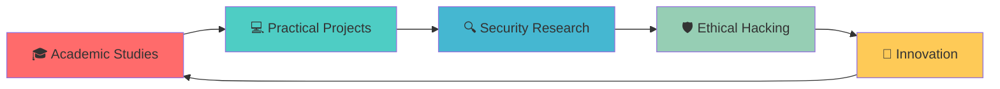

<div align="center">

```
    ██████╗██╗  ██╗██╗   ██╗ ██████╗██╗  ██╗███████╗    ███████╗███████╗██████╗  █████╗ ███╗   ██╗ ██████╗ ██╗      █████╗ 
   ██╔════╝██║  ██║██║   ██║██╔════╝██║ ██╔╝╚══███╔╝    ██╔════╝██╔════╝██╔══██╗██╔══██╗████╗  ██║██╔═══██╗██║     ██╔══██╗
   ██║     ███████║██║   ██║██║     █████╔╝   ███╔╝     █████╗  ███████╗██████╔╝███████║██╔██╗ ██║██║   ██║██║     ███████║
   ██║     ██╔══██║██║   ██║██║     ██╔═██╗  ███╔╝      ██╔══╝  ╚════██║██╔═══╝ ██╔══██║██║╚██╗██║██║   ██║██║     ██╔══██║
   ╚██████╗██║  ██║╚██████╔╝╚██████╗██║  ██╗███████╗    ███████╗███████║██║     ██║  ██║██║ ╚████║╚██████╔╝███████╗██║  ██║
    ╚═════╝╚═╝  ╚═╝ ╚═════╝  ╚═════╝╚═╝  ╚═╝╚══════╝    ╚══════╝╚══════╝╚═╝     ╚═╝  ╚═╝╚═╝  ╚═══╝ ╚═════╝ ╚══════╝╚═╝  ╚═╝
```


</div>

---

## 🔥 **About Me**

> *"Understanding systems by breaking them, building them stronger."*

🎓 **Junior Computer Science Student** with a passion for cybersecurity and ethical hacking  
🔍 **Penetration Testing Enthusiast** exploring vulnerabilities and security frameworks  
🛠️ **Reverse Engineering Explorer** diving deep into how systems work under the hood  
🔐 **Security-First Developer** building applications with robust security foundations

<div align="center">


</div>

---

## 🚀 **Featured Projects**

<table>
<tr>
<td width="50%">

### 🔗 **Kanshin Ledger**
*Secure Blockchain Framework*

```yaml
Description: Anonymous citizen feedback system
Focus: Data encryption & pseudonymous auth
Tech Stack: Blockchain • Cryptography • Privacy
Status: 🚧 In Development
```

**Key Features:**
- 🔐 End-to-end encryption
- 👤 Anonymous authentication
- 🔗 Immutable feedback records
- 🛡️ Privacy-first architecture

</td>
<td width="50%">

### 🚗 **VehiScan**
*Vehicle Registration Tracker*

```yaml
Description: Secure vehicle tracking system
Focus: Input validation & SQL injection prevention
Tech Stack: Security • API Design • Authentication
Status: ✅ Production Ready
```

**Key Features:**
- 🛡️ SQL injection protection
- 🔑 Robust authentication
- 📊 Real-time tracking
- 🔍 Advanced validation

</td>
</tr>
<tr>
<td width="50%">

### 💰 **Bankara**
*Digital Wallet Implementation*

```yaml
Description: Cryptographic payment system
Focus: Secure transaction handling
Tech Stack: FinTech • Cryptography • Backend
Status: 🔄 Testing Phase
```

**Key Features:**
- 💳 Secure transactions
- 🔐 Cryptographic protocols
- 💼 Multi-currency support
- 📱 Mobile-first design

</td>
<td width="50%">

### 📱 **Prepper**
*Meal Planning Application*

```yaml
Description: Secure meal planning platform
Focus: User data protection & session management
Tech Stack: Authentication • Firebase • Data Protection
Status: 🎯 Feature Complete
```

**Key Features:**
- 🔒 Secure sessions
- 📊 Nutritional tracking
- 🛡️ Data protection
- ☁️ Cloud synchronization

</td>
</tr>
</table>

---

## 🛠️ **Technology Arsenal**

### 💻 **Development Stack**
<div align="center">

[](https://skillicons.dev)

</div>

### 🛡️ **Security & Analysis Tools**
<div align="center">


</div>

### 🎯 **Specializations**
```
🔍 Penetration Testing    🔐 Cryptography         🛡️ Secure Development
🔧 Reverse Engineering   📊 Vulnerability Assessment   🌐 Network Security
💻 System Analysis       🔒 Authentication Systems     📱 Mobile Security
```

---

## 📈 **GitHub Analytics**

<div align="center">


</div>

<div align="center">

</div>

---

## 🎯 **Current Focus**



- 🔬 **Research:** Advanced cryptographic implementations
- 🎯 **Learning:** Cloud security and DevSecOps practices
- 🛠️ **Building:** Next-generation security tools
- 🤝 **Contributing:** Open-source security projects

---

## 🌟 **Let's Connect!**

<div align="center">

### 📬 **Get In Touch**

[](mailto:chuckz.espanola99@gmail.com)
[](https://linkedin.com/in/chuckz-española)
[](https://github.com/chuckzxxmello)

### 💬 **Open to Collaborate On:**
🔐 Security Research • 🛡️ Penetration Testing • 💻 Open Source Projects • 🎓 Learning Opportunities

---


</div>

---

<div align="center">
<sub>🔒 <strong>Ethical Hacking</strong> • 🛡️ <strong>Secure Development</strong> • 🔍 <strong>Continuous Learning</strong></sub>
</div>
```

